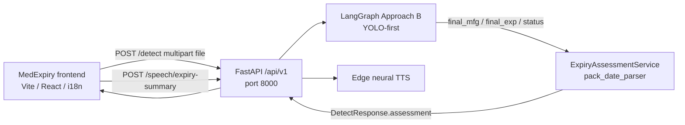
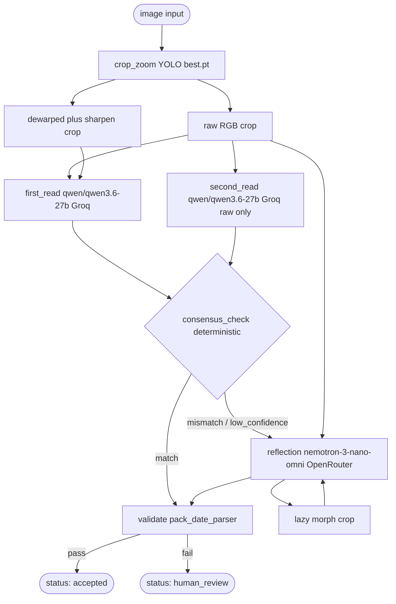

# Design Doc — MedExpiry (current production)

**Status:** production (API `1.0.0`)  
**Last updated:** August 2026  

This is the source-of-truth design for the current MedExpiry build
(YOLO-first localization → dual crop readers → optional reflection → deterministic validation).

**Repos**

| Area | Location |
|------|----------|
| Backend API | `AGENTIC_MEDICINE_PROJECT/` |
| Frontend UI | `frontend/` (Vite + React, brand **MedExpiry**) |

---

## 1. Goals

1. Read manufacturing (MFG) and expiry (EXP) dates from a medicine pack photo.
2. Cross-check with two independent VLM crop readers; adjudicate only when needed.
3. Never let an LLM be the last word on validity — deterministic parse + calendar checks.
4. Return an explicit **expired / not expired / unknown** verdict and a separate **human-review** flag for the UI and TTS.
5. Support multilingual UI + server TTS (Edge neural voices, no TTS API key) for Listen.

---

## 2. End-to-end architecture



**Request flow (frontend):** Component → `useDetect` → `detectService` → axios (`timeout` 300000 ms) → `POST /api/v1/detect`.  
The UI **does not** parse dates or decide expiry; it displays `result.assessment.*` only.

---

## 3. LangGraph pipeline (Approach B — YOLO-first)

**Code:** `src/api/core/services/date_detection_graph.py`  
**`model_pipeline`:** `approach_b_yolo_first`



There is **no** four-layer VLM waterfall. Dewarp and morph are extra **views** on the YOLO crop, not serial retries. Dewarp/morph never run before YOLO.

### 3.1 State (`DateDetectionState`)

Defined in `src/api/schemas/date_detection_state.py`:

| Field | Role |
|-------|------|
| `image_path`, `image_b64`, `attempt` | Inputs |
| `bbox_2d` | `[x1,y1,x2,y2]` from YOLO union rect (or full image on fallback) |
| `crop_path`, `crop_source` | Raw RGB crop; `yolo` \| `full_image_fallback` |
| `dewarped_crop_path` | Trapezoid-dewarped + sharpened helper (from `crop_zoom`) |
| `morph_crop_path` | Morphological helper; empty until reflection runs |
| `first_result`, `second_result` | Reader JSON (raw dates + confidence) |
| `consensus_status` | `match` \| `mismatch` \| `low_confidence` |
| `reflection_result` | Present only if reflection ran |
| `final_mfg`, `final_exp` | Chosen strings after consensus/reflection |
| `validation` | Boolean checks from `validate` |
| `status` | `accepted` \| `human_review` |

There is **no** `ground_and_read` / `ground_result` — localization is YOLO-only.

### 3.2 Node summary (model at every node)

| Node | Type | Model / method | Implementation | Notes |
|------|------|----------------|----------------|-------|
| `crop_zoom` | Deterministic | YOLO `best.pt` + OpenCV | `crop_zoom_node.py` | 15% pad; min crop width **500**; miss → full-image fallback; writes raw + dewarped crops |
| `first_read` | VLM | **`qwen/qwen3.6-27b`** @ Groq | `first_read_node.py` | **Two images in one call:** Image 1 natural RGB (primary), Image 2 dewarped+sharpened (helper). Prefer raw on conflict. |
| `second_read` | VLM | **`qwen/qwen3.6-27b`** @ Groq | `second_read_node.py` | **Raw RGB crop only.** Independent of first answer and of the dewarp helper. |
| `consensus_check` | Deterministic | none (string compare) | `consensus_check_node.py` | Normalize + compare; low confidence → reflection; **label-prefix guard** |
| `reflection` | VLM | **`nvidia/nemotron-3-nano-omni-30b-a3b-reasoning:free`** @ OpenRouter | `reflection_node.py` | Mismatch / low confidence only. Image 1 raw RGB (primary), Image 2 morph (lazy helper). |
| `validate` | Deterministic | `pack_date_parser` | `validate_node.py` | Sets `validation` + `status` |

### 3.3 Model pins

From `src/api/http_clients/key_pool.py`:

| Stage | Model ID | Provider |
|-------|----------|----------|
| Localization | Ultralytics YOLO `best.pt` | local weights |
| `first_read` | `qwen/qwen3.6-27b` (`QWEN36_GROQ`) | Groq |
| `second_read` | `qwen/qwen3.6-27b` (`QWEN36_GROQ`) | Groq |
| `consensus_check` | — | deterministic |
| `reflection` | `nvidia/nemotron-3-nano-omni-30b-a3b-reasoning:free` (`OMNI30B`) | OpenRouter |
| `validate` | — | `pack_date_parser` |

Emergency / alternate entry in `MODEL_SPECS`: `nvidia/nemotron-nano-12b-v2-vl:free` (not the primary path).

Keys: round-robin pools — `OPENROUTER_API_KEY` (+ `_2`…`_4`), `GROQ_API_KEY` (+ `_2`…`_10`). Retries on 429 with short backoff.

### 3.4 Localization (YOLO)

- Weights: `src/api/utils/yolo/best.pt` (required at API startup).
- Classes: date-region segmentation (`MFD_DATE` / `mfddatexp`); union mask → bbox + padding.
- YOLO miss → `crop_source=full_image_fallback`, crop = full image, `bbox_2d=[0,0,w,h]`.
- VLMs never propose `bbox_2d`.
- Dewarp and morph **never** run on the full photo before YOLO.

### 3.4.1 Crop helper views (`image_preprocess.py`)

Paper-parity geometry (not camera undistort, not a four-layer waterfall):

| Helper | When | Params |
|--------|------|--------|
| Trapezoid dewarp + 3×3 sharpen | After crop (always) | `offset = min(50, w//8)`; dest bottom pinched inward; `INTER_CUBIC` + `BORDER_REPLICATE`; sharpen kernel `[[-1,-1,-1],[-1,9,-1],[-1,-1,-1]]` |
| Morphological | Reflection only (lazy) | Gray → adaptive mean INV block **11**, C **10** → 2×2 close → invert (black on white) |

Files: `{stem}_crop{ext}` (raw), `{stem}_crop_dewarped{ext}`, `{stem}_crop_morph.png`.

**Accuracy-safety prompts:** first_read transcribes from Image 1 (raw); Image 2 is helper; on conflict prefer raw unless a digit is clearly more readable on dewarped. second_read never sees dewarp. reflection prefers raw; morph is extra reference only.

### 3.5 Consensus rules

1. Normalize strings (trim, upper, collapse spaces / double dashes).
2. **Match** (high confidence) → set `final_*` from reader A → `validate`.
3. **Match but any `low` confidence** → `low_confidence` → `reflection`.
4. **Mismatch** → `reflection`.
5. **Label-prefix guard:** if reader B returns label-only text (no `\d{2}` run) while A has numeric dates, treat as match from A and skip reflection (avoids OCR “EXP.” / “MFG” litter).

### 3.6 Validate pass conditions

Uses `src/api/utils/pack_date_parser.py` (same parser as assessment):

| Check | Meaning |
|-------|---------|
| `exp_parsed` | EXP matches a known pack format |
| `exp_in_future` | Today ≤ last valid day for EXP (month-only → end of month) |
| `exp_after_mfg` | If MFG parsed: EXP valid-through ≥ MFG date |
| `reflection_unresolved` | Must be false |

**Accept** iff EXP parsed ∧ not expired ∧ (no MFG or EXP after MFG) ∧ not reflection-unresolved.  
Else `status = human_review`.

---

## 4. Date parsing & expiry assessment

### 4.1 Pack date formats

`pack_date_parser.py` accepts (non-exhaustive):

- Month precision: `YYYY-MM`, `YYYY/MM`, `MM/YYYY`, `MM-YYYY`, `MM.YYYY`, `APR.2024`, `MAR 2027`, `AUG2024`, `MARCH 2027`, `YYYYMM`
- Day precision: `YYYY-MM-DD`, `DD-MM-YYYY`, `DD/MM/YYYY`, `DD.MM.YYYY`, `15 AUG 2024`, `15-AUG-2024`, `AUG 15, 2024`, `YYYYMMDD`, `DDMMYYYY`

Month-precision dates remain valid through the **last calendar day** of that month.

### 4.2 `ExpiryAssessmentService`

**Code:** `src/api/core/services/expiry_assessment_service.py`  
**Schema:** `src/api/schemas/expiry_assessment.py`

Embedded on every detect response; also available standalone.

| Field | Meaning |
|-------|---------|
| `expiry_status` | `valid` (not expired) \| `expired` \| `unknown` |
| `is_expired` | `true` / `false` / `null` |
| `needs_human_review` | Pipeline `status == human_review` **or** EXP unparsed |
| `mfg_parsed` / `exp_parsed` | Parse success |
| `mfg_iso` / `exp_iso` | Normalized ISO dates |
| `exp_valid_through` | Last valid day (ISO) |
| `exp_precision` | `day` \| `month` |
| `mfg_display` / `exp_display` | Localized month-name strings for UI and TTS (from `lang`) |
| `display_lang` | Language used for those strings (`en`, `ta`, …) |

**Important:** Expired vs not-expired is independent of human-review. The UI shows both.

---

## 5. Public API

**App:** `src/api/rest/app.py` — CORS from `CORS_ORIGINS` (default `*`), lifespan loads YOLO + key pools.  
**Router:** `src/api/rest/routes/detect_route.py` under `/api/v1`.

| Method | Path | Body | Response |
|--------|------|------|----------|
| `GET` | `/api/v1/` | — | Discovery (`health`, `detect`, `assess`) |
| `GET` | `/api/v1/health` | — | YOLO loaded, key counts, storage dir |
| `POST` | `/api/v1/detect` | multipart `file` | `DetectResponse` (+ `assessment`) |
| `POST` | `/api/v1/assess` | JSON `{ final_mfg?, final_exp?, status? }` | `AssessResponse` |

Allowed upload types: JPEG, PNG, WebP, BMP (plus `application/octet-stream`).

### 5.1 `DetectResponse` (high level)

```
status, final_mfg, final_exp, consensus_status, validation,
assessment,          ← ExpiryAssessment (always present)
bbox_2d, crop_source, crop_path, models_used,
first_result, second_result, reflection_result,
request_id, elapsed_ms, model_pipeline
```

Legacy routes `/detect` and `/detect-zero-shot` (outside `/api/v1`) are **removed**.

---

## 6. Frontend (MedExpiry)

**Stack:** Vite 8, React 19, TypeScript, Tailwind 4, axios, react-router-dom 7, i18next, lucide-react, react-hot-toast.

| Route | Page |
|-------|------|
| `/` | Landing |
| `/detect` | Upload → analyze → result + Listen / Stop |
| `*` | Redirect home |

**i18n:** `en`, `hi`, `ta`, `te`, `mr`, `bn`, `gu`, `kn`, `ml`, `pa` (persisted in `localStorage`).  
**TTS:** `POST /api/v1/speech/expiry-summary` (Microsoft Edge neural voices via `edge-tts`, no API key). Server renders one paragraph (status, dates, review) and returns MP3. Frontend plays with `HTMLAudioElement`. Stop aborts the fetch and pauses audio.  
**API base:** `VITE_API_URL` → default `http://127.0.0.1:8000`; axios timeout **5 minutes** (speech uses 30s).

Result card uses:

- `assessment.expiry_status` → Not expired / Expired / Unable to determine  
- `assessment.needs_human_review` → review chip  
- `consensus_status` → secondary “Models agree / …” copy  

---

## 7. Runbook

```bash
# Backend
cd AGENTIC_MEDICINE_PROJECT
uv sync --group dev
# On Windows paths with spaces, prefer:
uv run python -m uvicorn src.api.rest.app:app --host 0.0.0.0 --port 8000

# Frontend
cd frontend
npm install
npm run dev   # http://localhost:5173
```

**Env (backend):** at least one `OPENROUTER_API_KEY` and one `GROQ_API_KEY`; add `_2…N` (any count) or CSV `*_API_KEYS` for rotation. Optional `STORAGE_DIR`, `CORS_ORIGINS`, `RETAIN_DETECT_TEMPS`, `RAW_CROP_PIPELINE` (default `true` = raw crops only; `false` = dewarp on first_read + morph on reflection). Listen uses Edge TTS (no extra key).  
**Env (frontend):** `VITE_API_URL=http://127.0.0.1:8000`.

**Tests:** `uv run python -m pytest` (unit always; e2e detect needs keys).

---

## 8. Pipeline summary

| Stage | Implementation |
|-------|----------------|
| Localization | **YOLO `best.pt`** segmentation (never dewarped first) |
| Crop helpers | Dewarp+sharpen extra file; morph only on reflection |
| first_read | **`qwen/qwen3.6-27b`** (Groq) — raw + dewarped, prefer raw |
| second_read | **`qwen/qwen3.6-27b`** (Groq) — raw only |
| consensus_check | Deterministic string compare |
| Reflection | **`nvidia/nemotron-3-nano-omni-30b-a3b-reasoning:free`** (OpenRouter) — raw + morph |
| Validate | **`pack_date_parser`** + month-end calendar checks |
| Client verdict | **`assessment`** on detect + **`POST /assess`** |
| Speech | **`POST /speech/expiry-summary`** Edge neural TTS |
| Frontend | MedExpiry UI, 10 languages, server TTS playback |

Intentional design: independent dual crop reads (second reader still raw-only), low-confidence → reflection, unresolved reflection → human review, deterministic validate as last gate, round-robin key pools.
